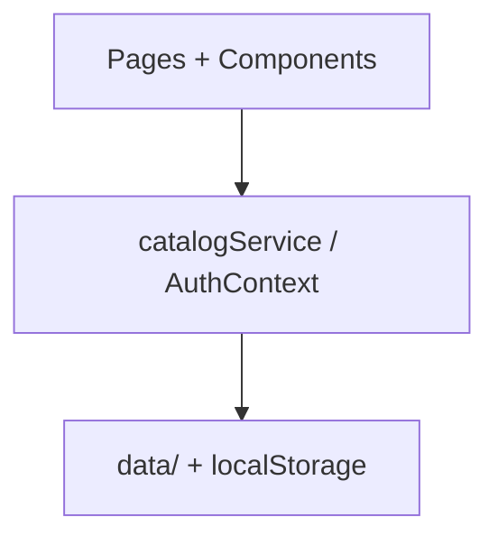

# ComuniApp

Plataforma web para conectar **residentes** con **proveedores de servicios locales** y gestionar el flujo de **emprendedores** que publican ofertas en la comunidad.

Proyecto académico (Análisis y diseño de sistemas) construido a partir del diseño Figma [Pixel Perfect Clone](https://www.figma.com/design/ivDiN3XaBY9MGQIddAsPT2/Pixel-Perfect-Clone), evolucionado hacia una arquitectura modular lista para integrar un backend real.

## Stack

| Tecnología | Uso |
|------------|-----|
| React 18 | UI |
| TypeScript | Tipado |
| Vite 6 | Build y dev server |
| React Router 7 | Enrutamiento |
| Tailwind CSS 4 | Estilos |
| Radix UI | Componentes accesibles (`src/app/components/ui/`) |
| localStorage | Auth, perfiles y datos simulados |

## Inicio rápido

```bash
pnpm install
pnpm run dev
```

Abre `http://localhost:5173` (puerto por defecto de Vite).

```bash
pnpm run build    # compilación de producción → dist/
```

## Cuentas de demostración

### Residente (login con auth real)

| Campo | Valor |
|-------|-------|
| Email | `residente@comuniapp.com` |
| Contraseña | `residente123` |

También puedes **registrarte** en `/registro`; el usuario queda persistido en `localStorage` y puede iniciar sesión después.

### Emprendedor

El login en `/login/emprendedor` redirige al tablero emprendedor (flujo simulado, sin validación de credenciales por ahora).

## Flujos principales

### Residente

1. **Landing** → `/`
2. **Registro / Login** → `/registro`, `/login`
3. **Dashboard** → `/dashboard` (protegido)
4. **Buscar servicios** → `/services/:categorySlug`
5. **Detalle de servicio** → `/service/:slug`
6. **Editar perfil** → `/perfil/editar`
7. **Historial** → `/historial`

Categorías de hogar disponibles: Electricistas, Limpieza, Mantenimiento, Fontanería, Jardinería.

### Emprendedor

1. **Login** → `/login/emprendedor`
2. **Registro** → `/registro/emprendedor` → crear perfil
3. **Tablero** → `/emprendedor/tablero`
4. **Listado de servicios** → `/emprendedor/servicios`
5. **Crear servicio** → `/emprendedor/servicios/crear`
6. **Editar perfil** → `/emprendedor/perfil/editar`
7. **Resultado de publicación** → `/emprendedor/resultado-cargue-serv`

Rutas antiguas (`/emprendedor/crear-servicios`, etc.) redirigen automáticamente a las nuevas.

## Arquitectura

```
src/
├── app/
│   ├── App.tsx              # Router principal
│   └── components/
│       ├── catalog/         # Catálogo reutilizable (cards, filtros, layout)
│       ├── dashboard/       # Header del residente
│       ├── emprendedor/     # Layout y tarjetas emprendedor
│       └── ui/              # Design system (shadcn/Radix)
├── context/
│   └── AuthContext.tsx      # Sesión y perfil del residente
├── data/                    # Datos estáticos / mock del catálogo
├── hooks/
│   └── useCatalogSearch.ts  # Búsqueda compartida
├── lib/
│   ├── auth/                # Credenciales, sesión, perfil, validación
│   └── catalog/             # Filtros, formatters, guards
├── pages/                   # Pantallas por ruta
├── routes/
│   └── paths.ts             # Fuente única de URLs (ROUTES)
└── services/
    └── catalogService.ts    # Capa de acceso a datos (API-ready)
```

### Capas



- **UI** no importa datos crudos del catálogo; usa `catalogService`.
- **catalogService** centraliza lectura, filtros y búsqueda. Hoy lee de `data/services.ts`; mañana puede llamar a una API sin cambiar las páginas.
- **Auth** del residente persiste en `localStorage` (`comuniapp_users`, `comuniapp_session`, `comuniapp_profiles`).

## Rutas

Todas las URLs están definidas en `src/routes/paths.ts` como `ROUTES`. Ejemplos:

| Ruta | Descripción |
|------|-------------|
| `/` | Landing |
| `/login` | Login residente |
| `/login/emprendedor` | Login emprendedor |
| `/dashboard` | Dashboard residente |
| `/services/electricians` | Resultados por categoría |
| `/service/:slug` | Detalle de servicio |
| `/emprendedor/tablero` | Dashboard emprendedor |
| `/ayuda`, `/contacto`, `/legal/privacidad` | Páginas de contenido |

## Catálogo de servicios

- **40 servicios** generados desde plantillas en `src/data/services.ts` (8 por categoría).
- Índices en memoria (`Map`) para búsqueda por slug y categoría.
- Filtros (precio, orden) aplicados en cliente vía `src/lib/catalog/filters.ts`.

### Agregar un servicio

Edita `TEMPLATES` en `src/data/services.ts` bajo la categoría deseada. El generador crea slug, proveedor, reseñas e imágenes.

### Agregar una categoría

1. Añade el slug en `CategorySlug` (`src/data/types.ts`)
2. Registra la categoría en `src/data/categories.ts`
3. Agrega icono/estilo en `src/data/categoryPresentation.ts`
4. Define plantillas en `src/data/services.ts`

## Conectar un backend

Reemplaza las implementaciones en `src/services/catalogService.ts` manteniendo las mismas firmas:

```typescript
export async function fetchServicesByCategory(
  categorySlug: string,
  filters?: ServiceListFilters,
): Promise<Service[]> {
  const res = await fetch(`/api/categories/${categorySlug}/services?...`);
  return res.json();
}
```

Endpoints sugeridos:

| Función | Método |
|---------|--------|
| `fetchCategories()` | `GET /api/categories` |
| `fetchServiceDetail(slug)` | `GET /api/services/:slug` |
| `searchServices(query)` | `GET /api/services/search?q=` |
| `fetchFeaturedServices()` | `GET /api/services/featured` |

Los tipos en `src/data/types.ts` (`Service`, `ServiceCategory`, `Provider`, etc.) son el contrato esperado con el API.

## Persistencia local (demo)

| Clave | Contenido |
|-------|-----------|
| `comuniapp_users` | Usuarios registrados |
| `comuniapp_session` | Sesión activa del residente |
| `comuniapp_profiles` | Perfil extendido (nombre, teléfono) |

## Scripts

| Comando | Acción |
|---------|--------|
| `pnpm run dev` | Servidor de desarrollo |
| `pnpm run build` | Build de producción |

## Estructura de diseño

- Tipografías: **Plus Jakarta Sans**, **Inter** (Google Fonts)
- Paleta principal: `#2d5bff`, `#0d1c2e`, `#f8f9ff`
- Assets Figma originales en `src/imports/`; pantallas activas en `src/pages/`

## Limitaciones actuales

- Datos de catálogo y emprendedor son **simulados** (sin API).
- Login emprendedor no valida credenciales contra `AuthContext`.
- Categorías Alimento, Salud y Mascotas muestran pantalla “Próximamente”.
- Recuperación de contraseña es informativa (sin envío real de correo).

## Licencia

Proyecto académico — uso educativo.
